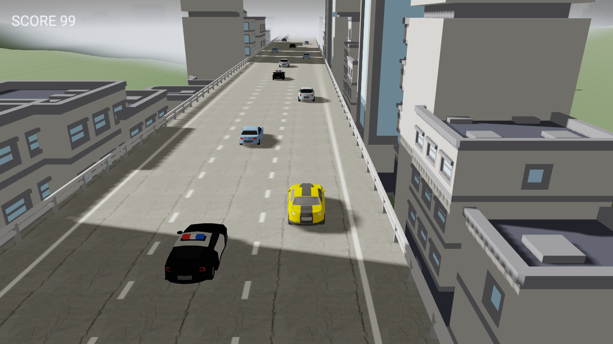

<div align="center">

# KamanEngine

**A Rust game engine for Apple platforms, rendering with raw Metal.**

[](https://github.com/parsabee/KamanEngine/actions/workflows/ci.yml)
[](https://github.com/parsabee/KamanEngine/actions/workflows/docs.yml)
[](https://parsabee.github.io/KamanEngine/)
[](https://github.com/parsabee/KamanEngine/releases)
[](#project-status)
<br>
[](LICENSE)
[](rust-toolchain.toml)
[-lightgrey?logo=apple)](#prerequisites)
[](docs/ARCHITECTURE.md)

[Quick start](#quick-start) ·
[Playable demo](#the-playable-demo) ·
[Documentation](#documentation) ·
[Roadmap](docs/ROADMAP.md) ·
[Contributing](#contributing)



<sub>The playable demo, rendered offscreen by the engine's Metal backend at 1280×720.</sub>

</div>

---

KamanEngine is a Cargo workspace of focused `kaman-*` crates for building games on **macOS and
iPhone**. Because both platforms use Metal natively, raw Metal is *one* code path, not two, and a
backend-agnostic render seam keeps the door open for a future portable backend without touching
engine logic.

Its first title is an **infinite car runner** (static meshes, no animation rigs, arcade physics).
A native scene editor for macOS on Apple Silicon is planned as
[Phase 5](docs/ROADMAP.md#phase-5--scene-editor-native-macos-apple-silicon).

> [!NOTE]
> KamanEngine is **pre-release and under active development**. There are no tagged releases yet,
> and the public API may change between commits. macOS is the supported platform today; iOS
> bring-up is planned (Phase 3).

## Table of contents

- [Features](#features)
- [Quick start](#quick-start)
- [The playable demo](#the-playable-demo)
- [Project status](#project-status)
- [Documentation](#documentation)
- [Workspace layout](#workspace-layout)
- [Contributing](#contributing)
- [License](#license)

## Features

- **Raw Metal behind a render seam.** `kaman-render-api` defines the render contract
  (`RenderDevice` / `FrameRecorder` traits and opaque handles). `kaman-render` is the only crate
  that depends on `metal`, and CI fails if the seam crate ever gains a `metal` dependency.
- **ECS** built on [`hecs`](https://crates.io/crates/hecs), with a shared vocabulary of engine
  components.
- **Physics** via [`rapier3d`](https://rapier.rs), stepped in lockstep with the simulation.
- **Fixed-timestep game loop** with a clean `Game` / `EngineCtx` boundary. The same loop drives
  both the windowed app and a headless driver.
- **World streaming** (spawn-ahead / despawn-behind) and a **floating-origin rebase** for endless
  worlds.
- **Asset import:** static glTF (`.gltf` / `.glb`) meshes and textures, uploaded once and
  referenced by handle.
- **A modern look stack:** MSAA, a gradient sky with a drivable sun disc, specular lighting,
  ground-hugging horizon fog, ACES tonemapping, and **real fitted shadow maps** with PCF filtering.
- **2D HUD overlay** with SDF text rendering.
- **Audio** built on [`kira`](https://crates.io/crates/kira): load-once sounds, one-shots, looping
  music, and master volume.
- **Testable by design:** a headless smoke oracle that runs with no GPU, plus golden pixel-hash
  tests that pin the renderer's output.
- **Fully documented API:** every engine crate compiles under `#![deny(missing_docs)]`, and the
  rustdoc is [published online](https://parsabee.github.io/KamanEngine/).

## Quick start

### Prerequisites

KamanEngine is **Apple-only** (macOS today, iOS planned). Check your toolchain before building:

```sh
./scripts/preflight.sh          # deps needed to build the engine today
./scripts/preflight.sh --ios    # also require the Phase 3 (iOS) + .metallib toolchain
```

There are two tiers of dependencies:

| Tier | Tools | Needed for |
|---|---|---|
| **Required now** | macOS · Rust ≥ 1.91 (`cargo`/`rustc`, MSRV enforced by cargo) · Apple `clang` + macOS SDK (Command Line Tools) | Building and running the engine on macOS |
| **iOS / KE-0107** | Full **Xcode** (`metal`/`metallib` shader compiler) · `rustup` + `aarch64-apple-ios`(`-sim`) targets | iOS bring-up (Phase 3) and precompiled `.metallib` shaders |

The Command Line Tools alone (`xcode-select --install`) cover the engine today, because shaders
currently compile at runtime. Full Xcode becomes required at Phase 3; installing it then also
unblocks KE-0107. The iOS targets are not needed yet:

```sh
rustup target add aarch64-apple-ios aarch64-apple-ios-sim   # Phase 3 only
```

**Toolchain:** `rust-toolchain.toml` pins `1.91.0` (with `rustfmt`, `clippy` and
`rust-analyzer`). rustup (the recommended setup) and CI honour it, and cargo also enforces the MSRV
through `rust-version`.

### Build, run and test

```sh
git clone https://github.com/parsabee/KamanEngine.git
cd KamanEngine

cargo build --workspace
cargo run -p playable-demo                               # the demo, windowed (Metal)
cargo test  --workspace
cargo clippy --workspace --all-targets -- -D warnings
cargo run -p playable-demo -- --smoke                    # headless oracle: 120 frames, exits 0
```

## The playable demo

[`games/playable-demo`](games/playable-demo) is the first title, an endless 3-lane freeway runner.
It is also the **reference example** for building a game on this engine: it touches nothing but
the engine's public API.

```sh
cargo run -p playable-demo             # windowed, Metal backend (macOS)
cargo run -p playable-demo -- --smoke  # headless oracle: 120 frames, prints "smoke: 120 frames OK", exits 0
```

| Key | Action |
|---|---|
| `Left` / `Right` | Move one lane left / right (one lane per press) |
| `Space` | Start the run from the title screen; replay after a crash |
| `Escape` | Quit |

Graphics settings (shadows, shadow distance, draw distance, resolution, full screen) are in the
**Graphics** menu in the macOS menu bar, and are remembered between launches.

- [docs/PLAYABLE_DEMO.md](docs/PLAYABLE_DEMO.md): how the demo is built. Covers the
  `Game`/`EngineCtx` boundary, the fixed-timestep loop, streaming + floating-origin rebase, asset
  loading, the render seam, the HUD, and determinism/testing.
- [docs/GETTING_STARTED.md](docs/GETTING_STARTED.md): **build your own game**. The minimal steps
  to stand up a new `Game`, load an asset, record a draw, and run it windowed and headless.
- [games/playable-demo/README.md](games/playable-demo/README.md): the demo's own README, with the
  code layout, the asset bakers, and asset licences.

## Project status

KamanEngine is built by **migrating and refactoring** an earlier prototype into this repo, module
by module, under a test-and-document-as-you-go discipline: nothing is migrated without unit tests
and rustdoc. The work runs as a **phase-gated pipeline**. Each phase defines work, writes tickets,
implements them, runs SQA, and must hit its OKRs before the next phase starts. The prototype's
provenance is recorded in [docs/ARCHITECTURE.md](docs/ARCHITECTURE.md).

**32 / 38 tickets done.** For live per-phase progress, run `python3 scripts/check-tickets.py`.

| Phase | State |
|---|---|
| 0 — Foundation & migration harness | ✅ Complete |
| 1 — Renderer foundation | ✅ Complete except KE-0107 (precompiled `.metallib`), which is blocked on full Xcode |
| 2 — Gameplay core | ✅ Complete |
| 3 — iOS bring-up | ⏳ Not started; needs full Xcode + iOS rustup targets |
| 4 — Look & feel + content | ✅ Complete: glTF import, textures, modern-look stack, 2D HUD/SDF text, audio (kira), sun/sky seam, and real fitted shadow maps (KE-0407) |
| 5 — Scene editor (native macOS, Apple Silicon) | ⏳ Not started; Key Results are draft |
| 6 — Release | ⏳ Not started |
| 7 — Playable Demo *(pulled forward)* | ✅ Complete: 3-lane freeway runner with real CC0 cars, buildings, road and skyline, HUD, title/game-over/replay, music + SFX |

- Roadmap and phase OKRs: [docs/ROADMAP.md](docs/ROADMAP.md)
- Ticket system and backlog: [tickets/README.md](tickets/README.md)

## Documentation

**API reference: <https://parsabee.github.io/KamanEngine/>.** It is built from rustdoc and
published to GitHub Pages on every push to `main` (see
[`.github/workflows/docs.yml`](.github/workflows/docs.yml)). CI keeps it free of broken intra-doc
links. To build it locally:

```sh
cargo doc --workspace --no-deps --open
```

Guides and design docs:

| Document | What it covers |
|---|---|
| [docs/GETTING_STARTED.md](docs/GETTING_STARTED.md) | Build your own game on the engine |
| [docs/PLAYABLE_DEMO.md](docs/PLAYABLE_DEMO.md) | The demo walked through as a reference example |
| [docs/DESIGN.md](docs/DESIGN.md) | Diagrams: component, UML class and sequence diagrams (Mermaid) of the layers, the render seam, the frame loop, streaming, and asset load |
| [docs/ARCHITECTURE.md](docs/ARCHITECTURE.md) | Intentional constraints, the render seam, and workspace layout |
| [docs/ROADMAP.md](docs/ROADMAP.md) | Phases and OKRs |
| [docs/INTEGRATION.md](docs/INTEGRATION.md) | Integration, testing and migration discipline |

## Workspace layout

The workspace is `crates/kaman-*` (the engine) plus `games/playable-demo` (the first title and the
smoke oracle). The layout follows [docs/ARCHITECTURE.md](docs/ARCHITECTURE.md) §3.

| Crate | Purpose |
|---|---|
| [`kaman-core`](crates/kaman-core) | Application lifecycle and the engine/game boundary: the `Game` trait, `EngineCtx`, the fixed-timestep loop, input, and the windowed (winit) and headless drivers |
| [`kaman-render-api`](crates/kaman-render-api) | Backend-agnostic render seam: `RenderDevice` / `FrameRecorder` traits, opaque handles, descriptors, sun/sky and 2D overlay types, and a `NullRenderer` test double. Never depends on `metal` |
| [`kaman-render`](crates/kaman-render) | Raw-Metal implementation of the seam: rasterization pipeline, look stack, shadow maps, offscreen rendering and pixel read-back, plus an off-by-default `raytracer` feature |
| [`kaman-assets`](crates/kaman-assets) | Static glTF import and asset cache (metal-free) |
| [`kaman-audio`](crates/kaman-audio) | Audio over `kira`: load-once sounds, one-shot playback, looping music, master volume |
| [`kaman-camera`](crates/kaman-camera) | Camera state and controller math (perspective camera, chase controller) |
| [`kaman-ecs`](crates/kaman-ecs) | `hecs` wrapper and the shared engine components |
| [`kaman-math`](crates/kaman-math) | Shared math layer: `glam` re-export plus the `Transform` (TRS) type |
| [`kaman-perf`](crates/kaman-perf) | Profiling and frame-timing instrumentation with an injectable clock |
| [`kaman-physics`](crates/kaman-physics) | `rapier3d` wrapper with a body/collider removal API |
| [`kaman-scene`](crates/kaman-scene) | The `Scene`: ECS world + physics world, world streaming, and floating-origin rebase |
| [`games/playable-demo`](games/playable-demo) | The reference example game (an endless runner) and host of the headless smoke oracle |

Physics uses rapier for now; a custom arcade-physics / spatial-query layer will replace it later.

## Contributing

Work is tracked as tickets in [`tickets/`](tickets/README.md), grouped by roadmap phase. Each
ticket has a Scope & Acceptance checklist. Run `python3 scripts/check-tickets.py` after creating
or editing a ticket; CI lints the ticket format.

Every change must keep the CI gates green (see [docs/INTEGRATION.md](docs/INTEGRATION.md)):

```sh
cargo build --workspace
cargo test  --workspace
cargo clippy --workspace --all-targets -- -D warnings
cargo run -p playable-demo -- --smoke
RUSTDOCFLAGS="-D rustdoc::broken_intra_doc_links -D rustdoc::private_intra_doc_links" \
  cargo doc --workspace --no-deps
```

- **Document everything public.** Engine crates compile under `#![deny(missing_docs)]`.
- **Test as you go.** New or migrated code ships with unit tests, and renderer changes keep the
  pixel-hash tests passing.
- **Respect the render seam.** Nothing above `kaman-render` may depend on `metal`.
- **Commit style:** a short subject line (prefixed with the ticket ID where there is one, e.g.
  `KE-0407: …`) followed by an itemised list of the actual changes.

## License

Licensed under the [Apache License, Version 2.0](LICENSE). See [LICENSE](LICENSE) and
[NOTICE](NOTICE).

You are free to use, modify and distribute KamanEngine, including commercially, as long as you
retain the copyright and attribution notices the license requires. Third-party demo assets carry
their own licences, listed in [games/playable-demo/README.md](games/playable-demo/README.md).
