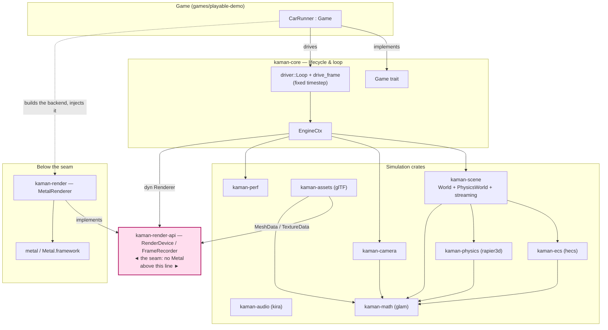
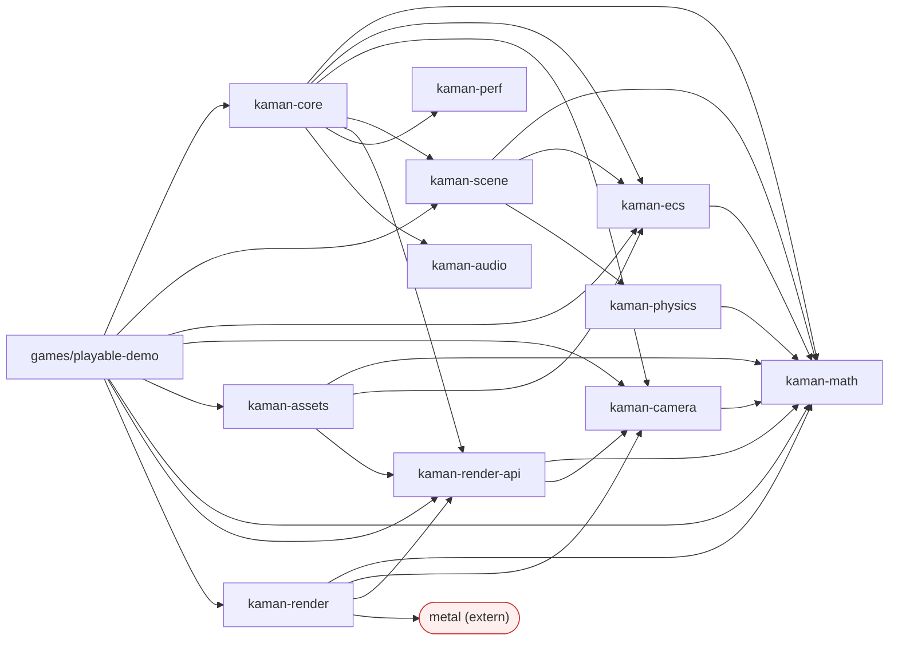
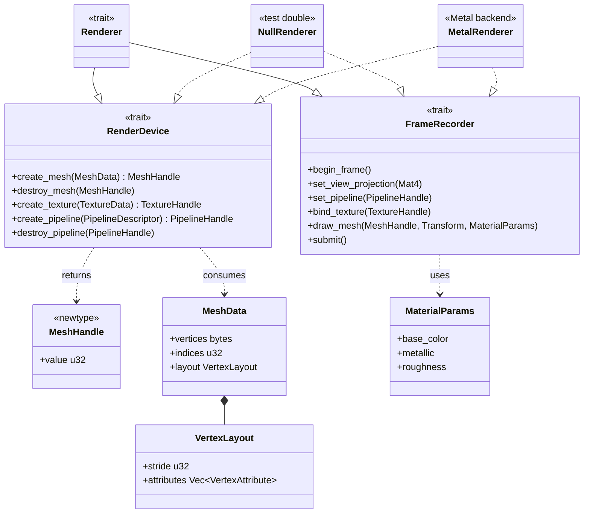
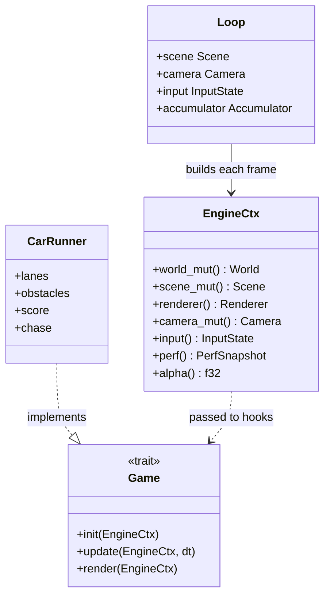
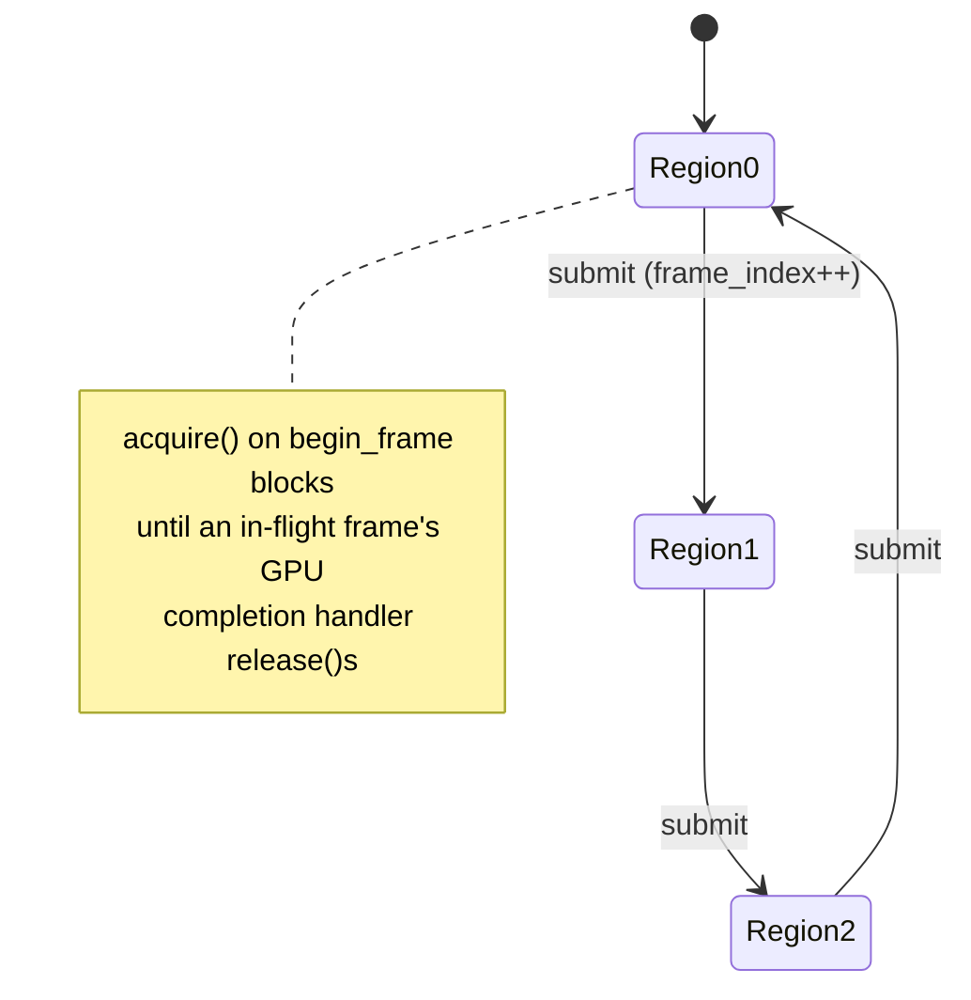
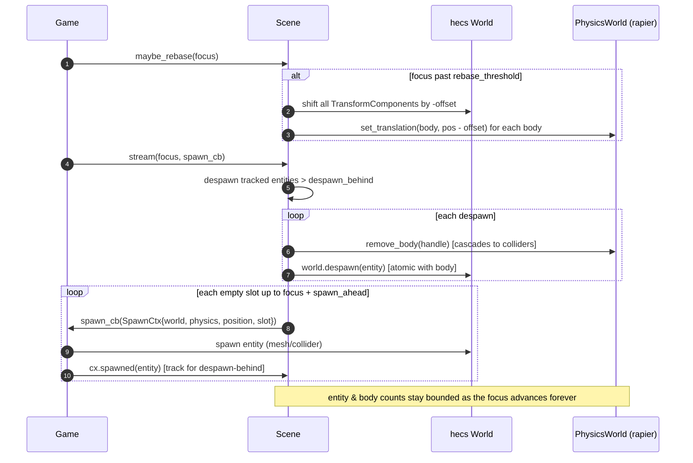
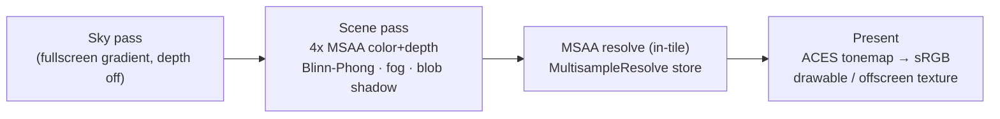

# KamanEngine — Design & Diagrams

A visual walkthrough of the architecture: component structure, UML class diagrams of the
key contracts, and sequence diagrams of the runtime flows. The authoritative *constraints*
live in [ARCHITECTURE.md](ARCHITECTURE.md); this document shows how the pieces fit and move.
Diagrams are [Mermaid](https://mermaid.js.org/) (rendered inline by GitHub).

> Scope: reflects the engine through Phase 4 (KE-0401). `kaman-assets`/`kaman-render` texturing
> and the look stack are included; `kaman-script` (Phase 5) is not yet built.

---

## 1. System layers

The game only ever talks to the engine's public API. Everything Metal lives **below the render
seam**; nothing above it may import `metal`.



The `playable-demo` **binary** is the only thing that both implements `Game` *and* constructs the
Metal backend — it injects the backend into `kaman-core` through a factory, so `kaman-core` itself
never depends on `metal`.

---

## 2. Crate dependency graph

Acyclic, leaf-first (`kaman-math` at the bottom). `metal` is reachable **only** through
`kaman-render` and the `playable-demo` binary — the CI firewall asserts it never enters `kaman-core`
or `kaman-render-api`.



---

## 3. The render seam (UML)

`kaman-render-api` defines opaque handles, two traits, and plain-data descriptors — no Metal
types. `NullRenderer` (headless) and `MetalRenderer` (GPU) both implement the traits; `kaman-core`
combines them into a `Renderer` marker via a blanket impl.



---

## 4. Engine/game boundary (UML)

The engine owns the loop and hands the game a narrow `EngineCtx` each frame. Accessors expose only
engine services — no Metal, no game types leak across.



---

## 5. The fixed-timestep frame (sequence)

`driver::drive_frame` banks real elapsed time, runs `update` + physics a whole number of fixed
steps, then renders once. Ordering inside a step is `update → step_physics`; the game calls
`maybe_rebase` at the top of its `update` (giving the documented `stream → step_physics →
maybe_rebase` cadence).

```mermaid
sequenceDiagram
    autonumber
    participant Clock as Clock (winit / synthetic)
    participant Loop as drive_frame
    participant Acc as Accumulator
    participant Game
    participant Scene
    participant Cam as Camera
    participant R as Renderer (seam)

    Clock->>Loop: elapsed dt
    Loop->>Acc: advance(elapsed) → n steps (clamped)
    loop n fixed steps (FIXED_DT)
        Loop->>Game: update(ctx, FIXED_DT)
        Game->>Scene: maybe_rebase(focus) / stream(focus, spawn)
        Loop->>Scene: step_physics()
    end
    Loop->>Cam: view_projection_matrix()
    Loop->>R: set_view_projection(vp)
    Loop->>Game: render(ctx)  [records draws via the seam]
    Note over Loop,R: exactly one render per displayed frame (alpha = remainder / FIXED_DT)
```

Headless (`--smoke`, tests) and the winit windowed path share this one `drive_frame`; only the
clock source differs (synthetic vs real monotonic).

---

## 6. Recording a frame through the seam (sequence)

Inside `Game::render`, the game records draws via `ctx.renderer()`. The Metal backend paces the CPU
with a triple-buffered semaphore signalled from the command-buffer completion handler.

```mermaid
sequenceDiagram
    autonumber
    participant Game
    participant R as MetalRenderer (FrameRecorder)
    participant Sem as FrameSemaphore (3 permits)
    participant GPU as Metal / GPU

    Game->>R: begin_frame()
    R->>Sem: acquire()  [blocks if 3 in flight]
    R->>R: pick ring region (frame_index mod 3)
    loop each visible entity
        Game->>R: set_pipeline(h) / bind_texture(t)
        Game->>R: draw_mesh(mesh, transform, material)
        R->>R: write MVP (+material) into uniform ring slot (256-aligned)
    end
    Game->>R: submit()
    R->>GPU: commit command buffer + present drawable
    GPU-->>Sem: completion handler → release()
    Note over R,GPU: no new_buffer* on the per-frame path (KR1.2); mesh & uniform storage persistent
```

---

## 7. Frames-in-flight (state)

The uniform ring is pre-partitioned into 3 disjoint regions; region `F` is reused only by frame
`F+3`, and the CPU can't start `F+3` until `F`'s completion handler releases a permit — so it never
overwrites a slot the GPU is still reading.



---

## 8. World streaming + atomic despawn + rebase (sequence)

`kaman-scene` owns the ECS `World` and the `PhysicsWorld`. Streaming spawns ahead of a focus point
and despawns behind it; despawn removes the physics body **before** the ECS entity so no live
`PhysicsBodyComponent` ever holds a freed handle. A floating-origin rebase shifts everything back
toward the origin between physics steps.



---

## 9. Asset load pipeline (sequence)

At load time (`Game::init`), the game imports a glTF file into a `SceneAsset` and uploads it once
through the seam. The `AssetCache` dedups by path so one file parses + uploads a single time.

```mermaid
sequenceDiagram
    autonumber
    participant Game
    participant Cache as AssetCache
    participant Import as kaman-assets::import
    participant Dev as RenderDevice (seam)

    Game->>Cache: load(device, "cube.gltf")
    alt not cached
        Cache->>Import: import_gltf(path)
        Import-->>Cache: SceneAsset (meshes[pos,normal,uv], base-color RGBA8, node tree)
        Cache->>Dev: create_texture(TextureData) → TextureHandle
        Cache->>Dev: create_mesh(MeshData{layout}) → MeshHandle
    else cached
        Cache-->>Game: shared handles (parsed once)
    end
    Game->>Game: store handles; draw per frame via draw_mesh(handle, ...)
    Note over Import,Dev: textured mesh → [pos,normal,uv] layout; untextured → [pos,normal,color]
```

---

## 10. Render passes / look stack (KE-0401)

All below the seam in `kaman-render`. Lighting is computed in linear space; the final present is
ACES-tonemapped + sRGB-encoded.



MSAA/depth storage is behind one `cfg` hook (`msaa_storage_mode()`) so KE-0305 can make the
attachments **memoryless** on iOS. Bloom is deferred.

---

## 11. Cross-cutting invariants (and how they're enforced)

| Invariant | Where | Enforced by |
|---|---|---|
| No Metal above the seam | `kaman-core`, `kaman-render-api`, … | CI `cargo tree \| grep metal` firewall |
| No game types in engine crates | all `kaman-*` | self-scanning `no_game_specific_symbols` tests |
| Rendered output unchanged across a refactor | `kaman-render` | offscreen **pixel-hash** tests (re-bless w/ justification) |
| Zero per-frame GPU allocations | `kaman-render` | `allocation_count()` asserted `== 0` on the frame path |
| Audio never requires a device | `kaman-audio` | `Loop` starts `Audio::silent()`; headless/`--smoke` never open one, and every audio test asserts against silent mode |
| Stale physics handle is safe | `kaman-physics` | use-after-free tests (queries → `None`, never a bad deref) |
| Physics body removed atomically with its entity | `kaman-scene` | despawn removes body **before** ECS entity + test |
| Simulation is framerate-independent | `kaman-core` | fixed `FIXED_DT`; 60 vs 120 Hz step-count tests |
| No prototype identifiers ship | `crates/`, `games/` | CI de-brand grep |
| Ticket format + progress | `tickets/` | `scripts/check-tickets.py` (CI) |

---

## See also

- [PLAYABLE_DEMO.md](PLAYABLE_DEMO.md) — these seams as the demo actually uses them, with pointers
  into its code. · [GETTING_STARTED.md](GETTING_STARTED.md) — build your own game on them.
- [ARCHITECTURE.md](ARCHITECTURE.md) — authoritative constraints (the *why*).
- [ROADMAP.md](ROADMAP.md) — phases + OKRs. · [INTEGRATION.md](INTEGRATION.md) — test/migration discipline.
- Inline API docs: `cargo doc --workspace --no-deps --open`.
